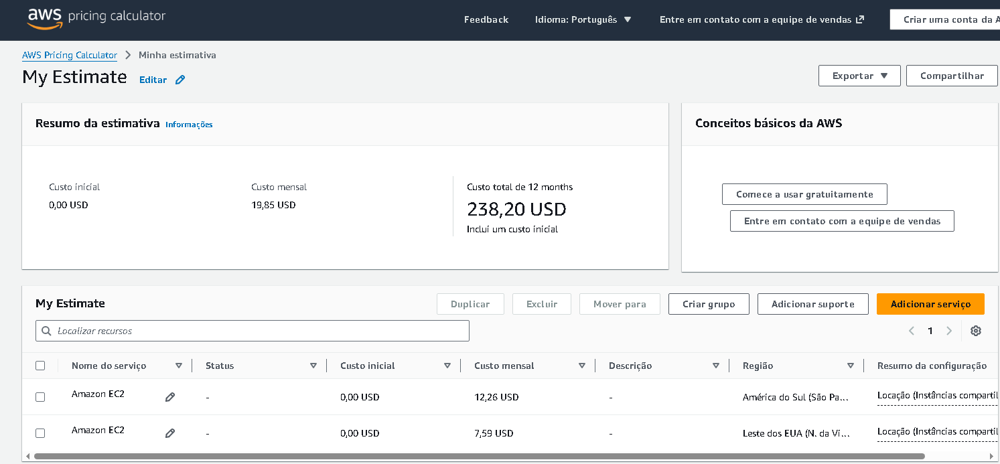
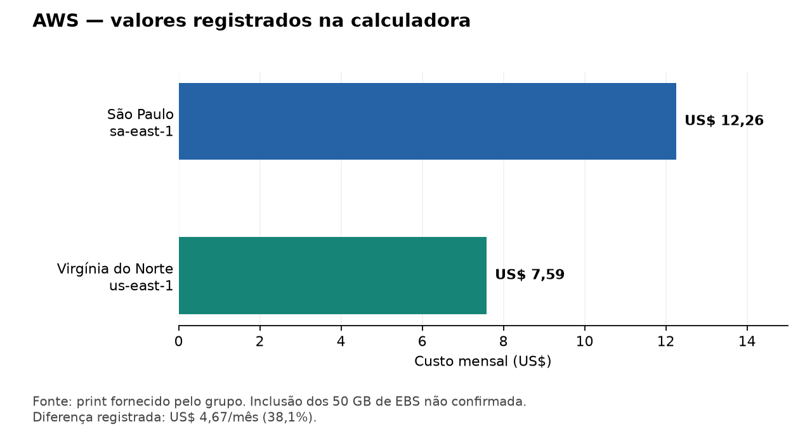

# Entrega 2 — Computação em nuvem (AWS)

## Objetivo

Comparar o custo de hospedar uma API de Machine Learning em Linux nas regiões
São Paulo (`sa-east-1`) e Virgínia do Norte (`us-east-1`), considerando custo,
latência e proteção de dados. A API é o cenário de hospedagem avaliado nesta
estimativa; esta documentação não representa uma implantação na AWS.

## Configuração avaliada

| Item | Configuração |
| --- | --- |
| Instância | Amazon EC2 `t3.micro` |
| Processamento | 2 vCPUs |
| Memória | 1 GiB |
| Rede | Até 5 Gbit/s em rajadas |
| Sistema operacional | Linux |
| Contratação | On-Demand, uso contínuo (730 horas/mês) |
| Armazenamento previsto | 50 GB de EBS |

A [documentação da AWS sobre T3](https://aws.amazon.com/ec2/instance-types/t3/)
confirma as características da instância. A família usa créditos de CPU para
atender picos de processamento; os recursos anunciados não significam desempenho
máximo sustentado. A capacidade para atender a API precisa ser validada com testes
de carga e consumo de memória.

## Estimativa registrada

O grupo informou que a simulação foi realizada em **07/09/2026**, na
[AWS Pricing Calculator](https://calculator.aws). O print registra os seguintes
valores mensais:

| Região | Valor exibido para Amazon EC2 |
| --- | ---: |
| São Paulo | US$ 12,26 |
| Virgínia do Norte | US$ 7,59 |
| Diferença | US$ 4,67 |

Virgínia apresenta um valor aproximadamente **38,1% menor** nessa comparação:
`(12,26 − 7,59) ÷ 12,26 × 100`. Os US$ 19,85 exibidos no resumo são a soma das duas
alternativas, não o custo de escolher uma única região.

Os valores da tabela e do gráfico reproduzem o print fornecido. A imagem não
apresenta o detalhamento dos 50 GB de EBS, portanto não permite verificar
separadamente o custo do armazenamento. Os preços estão sujeitos a alteração.

## Comparação visual

O gráfico reproduz os valores do print, com a mesma limitação sobre armazenamento.

## Escolha da região

**São Paulo é a recomendação inicial**, considerando que a fazenda e os usuários
estejam no Brasil. A proximidade geográfica tende a favorecer a latência, mas essa
vantagem deve ser verificada com medições a partir da conexão utilizada pela fazenda.
A necessidade de resposta em tempo real depende dos requisitos da aplicação.

A LGPD se aplica a dados relacionados a pessoas naturais identificadas ou
identificáveis. Dados de sensores não são automaticamente dados pessoais; é preciso
avaliar se podem ser associados a pessoas. A lei também não impõe uma obrigação
geral de manter todos os dados no Brasil: transferências internacionais são
permitidas quando atendem aos mecanismos e requisitos aplicáveis. Hospedar em São
Paulo, por si só, não garante conformidade. Essas condições são explicadas pela
[ANPD sobre dados pessoais](https://www.gov.br/anpd/pt-br/acesso-a-informacao/perguntas-frequentes/perguntas-frequentes)
e sobre [transferências internacionais](https://www.gov.br/anpd/pt-br/assuntos/assuntos-internacionais/transferencia-internacional-de-dados).

O acréscimo registrado de US$ 4,67/mês para São Paulo pode ser aceitável caso a menor
latência seja relevante para a operação. A escolha deve considerar o detalhamento do armazenamento
e as medições de latência. Virgínia continua sendo uma alternativa se atender
aos requisitos técnicos e às condições de proteção de dados aplicáveis.

## Evidências e vídeo

- [Print da AWS Pricing Calculator](aws_estimate.png).
- [Vídeo demonstrativo — comparação de custos na AWS](https://www.youtube.com/watch?v=CHrZ8GJ93vY).
