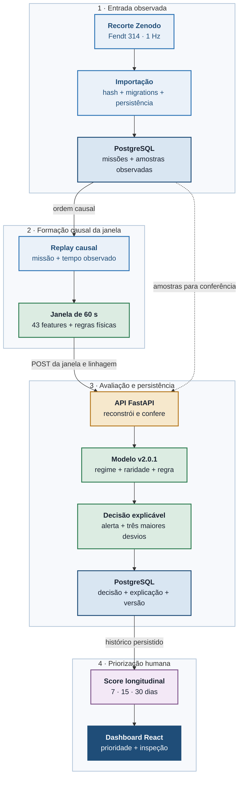
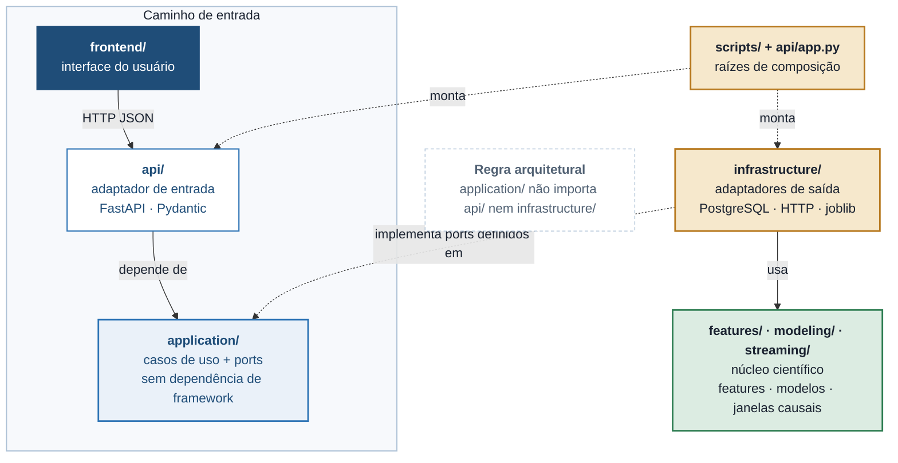

# Avaliação de Telemetria Fendt 314: Exposição Operacional Contextual para Inspeção Preventiva

**Um modelo híbrido, auditável e integrado a PostgreSQL, API e dashboard para o seguro agrícola**

Grupo SEIVA · Enterprise Challenge FIAP × Sompo Seguros

Karina Queiroz de Gennaro, RM 570928¹ · Luis Felipe Bardi, RM 569479¹ · Beatriz de Oliveira Ossola Ribeiro, RM 570190¹

¹ Faculdade de Informática e Administração Paulista (FIAP)

## Resumo

Este trabalho apresenta uma avaliação de telemetria para tratores Fendt 314
orientada à prevenção e à priorização de inspeções no contexto do seguro
agrícola. A evidência científica parte do histórico observado de uma unidade
Fendt 314 publicada no dataset aberto *Agricultural Load Cycles: Tractor
Mission Profiles From Recorded GNSS and CAN Bus Data*, da Technical University
of Munich, disponível no Zenodo sob licença CC BY 4.0. O problema tratado é
deliberadamente mais estreito do que prever dano ou sinistro: como o dataset não
possui rótulos de falha, manutenção, indenização ou mau uso, o sistema identifica
exposição operacional contextual e não uma probabilidade de perda segurada. A
telemetria é organizada em janelas causais de 60 segundos e representada por 43
variáveis agregadas. O modelo híbrido primeiro identifica três regimes de
operação por K-Means; em seguida, mede a raridade de cada janela com uma
Isolation Forest específica do regime; por fim, exige simultaneamente uma
condição física sustentada por pelo menos cinco segundos. A saída é um alerta
explicável e um score longitudinal relativo ao histórico de treino em horizontes
de 7, 15 e 30 dias. A divisão temporal usa 7.317 janelas de treino, 2.522 de
validação e 3.617 de teste posterior. A validação produziu 74 alertas (2,93%) e
68 episódios; o teste temporal consumido produziu 95 alertas (2,63%) e 79
episódios. O artefato `fendt314-hybrid-v2.0.1` está congelado e integrado a uma
cadeia executável local: importação observada, PostgreSQL, replay
causal, API FastAPI, persistência da decisão e dashboard React. A demonstração
versionada importa
152.561 amostras em 105 missões e reproduz 2.522 decisões, enquanto a suíte
completa registra 116 testes Python e 25 testes de frontend aprovados. A
contribuição do projeto é mostrar,
com rastreabilidade e limites explícitos, como um modelo de IA não supervisionado
pode sair do experimento e operar em uma aplicação verificável sem ser
indevidamente apresentado como diagnóstico mecânico ou modelo atuarial.

**Palavras-chave:** Seguro Agrícola; Telemetria de Tratores; Fendt 314;
Detecção de Anomalias; K-Means; Isolation Forest; Exposição Operacional;
Inspeção Preventiva; Explicabilidade; PostgreSQL; FastAPI; Clean Architecture.

# 1. Introdução

Máquinas agrícolas concentram valor patrimonial elevado e operam sob condições
que mudam com implemento, solo, tarefa, clima e conduta operacional. Para uma
seguradora, o desafio não é apenas observar um evento depois que ele ocorreu,
mas encontrar sinais que ajudem a decidir onde uma inspeção preventiva pode
gerar mais valor. Para o gestor da frota, o problema equivalente é transformar
milhões de amostras de telemetria em uma indicação compreensível, sem exigir que
uma pessoa interprete manualmente RPM, torque, carga, patinagem e engate.

O projeto responde a esse problema com uma pergunta compatível com os dados
disponíveis: **em quais janelas a máquina apresenta uma condição física
sustentada e, ao mesmo tempo, um comportamento raro para o regime em que está
operando?** Essa formulação evita criar um alvo inexistente. Não há no dataset
uma coluna que confirme dano, quebra, manutenção ou sinistro; portanto, não há
base para treinar ou medir um classificador desses desfechos.

A solução combina conhecimento de engenharia com aprendizado não supervisionado.
As regras físicas são explícitas e auditáveis. O K-Means separa contextos de
operação. A Isolation Forest mede raridade dentro de cada contexto. O alerta só
existe quando os dois lados concordam. Em vez de usar o alerta isolado como
sentença, a aplicação agrega exposição física, tempo alertado e episódios em
7, 15 e 30 dias, sempre informando cobertura e confiança.

O modelo é o núcleo do trabalho, mas não fica isolado em um notebook. O projeto
inclui importação de dados observados, PostgreSQL, API, reconstrução autoritativa
das janelas, frontend e fluxo persistido de inspeção. Assim, a entrega demonstra
tanto a construção acadêmica do modelo quanto sua implantação em uma aplicação
legível e reproduzível.

# 2. Caracterização Quantitativa

O dataset de origem reúne 1.245 horas de operação de cinco tratores, com GNSS de
alta resolução e dados dos barramentos J1939 e ISOBUS [1]. Este projeto seleciona
o arquivo do Fendt 314 e trata o histórico observado dessa unidade como referência
científica. A origem temporal absoluta foi recuperada por três âncoras
independentes presentes nos arquivos de transporte. As três convergiram para o
mesmo epoch UTC, permitindo reconstruir aproximadamente 226 horas, 80 dias com
telemetria e 555 missões entre abril e dezembro de 2024.

A separação experimental é cronológica, nunca aleatória por janela. Treino e
validação orientam seleção e congelamento; o teste representa um período
posterior e foi aberto uma única vez. A Tabela 1 resume o censo utilizado.

| Conjunto | Intervalo | Missão analítica | Janelas | Resultado principal |
|---|---|---|---:|---|
| Treino | 26/04 a 30/08/2024 | ajustar pré-processamento, regimes, detectores e baseline | 7.317 | referência aprendida |
| Validação | 07/09 a 19/10/2024 | selecionar pelos gates predefinidos | 2.522 | 74 alertas; 68 episódios |
| Teste temporal | 21/10 a 04/12/2024 | avaliação final posterior | 3.617 | 95 alertas; 79 episódios |
| Demo versionada | 07/09 a 19/10/2024 | provar execução ponta a ponta | 152.561 amostras; 105 missões | 2.522 janelas; 74 alertas |

**Tabela 1.** Divisão temporal, finalidade e volume da evidência utilizada.

Na validação, 40,40% das janelas satisfizeram ao menos uma regra física e 7,26%
dessas janelas também ultrapassaram o limiar de raridade contextual. A fração
final de alertas foi 2,93%. No teste posterior, a elegibilidade física foi
22,59%, a retenção contextual foi 11,63% e a fração final de alertas foi 2,63%.
Três famílias de condições físicas apareceram nos dois períodos.

Esses resultados não são taxa de acerto para dano. Eles medem estabilidade de
um detector híbrido sob critérios operacionais definidos antes da abertura do
teste. A ausência de um alerta também não significa operação segura: pode
significar apenas que não houve evidência suficiente naquela janela.

# 3. Personas

A solução atende dois lados do processo preventivo: o especialista da
seguradora que precisa priorizar análise e o gestor que precisa entender a
exposição da frota. O operador individual não recebe nota e não é uma persona
avaliada pelo sistema.

## 3.1 Ana Martins, analista de riscos e inspeções na seguradora

**Contexto.** Ana trabalha na área técnica de seguros para máquinas agrícolas.
Ela acompanha uma carteira com muitos equipamentos e precisa escolher quais
casos merecem contato, vistoria ou acompanhamento preventivo.

**Dores.** A telemetria bruta é volumosa e difícil de comparar. Um simples
limiar de RPM ou torque gera alarmes fora de contexto, enquanto um modelo
caixa-preta não permite explicar por que uma máquina foi priorizada. Além disso,
Ana não pode tratar um padrão operacional como dano confirmado ou usar um score
experimental para negar cobertura.

**Necessidades.** Uma indicação rastreável até as amostras observadas; regras e
limiares versionados; explicação das variáveis que tornaram a janela rara;
visões de 7, 15 e 30 dias; e um fluxo em que a decisão final continua humana.

## 3.2 Carlos Mendes, cliente segurado e gestor de frota

**Contexto.** Carlos administra uma frota homogênea de tratores Fendt 314 e
responde pela disponibilidade das máquinas, pelo planejamento de manutenção e
pela interlocução com a seguradora.

**Dores.** Ele recebe muitos dados, mas pouca informação acionável. Alertas sem
contexto confundem trabalho pesado legítimo com exposição atípica. Também não
quer um sistema de vigilância de operadores nem uma pontuação que pareça acusar
mau uso sem inspeção.

**Necessidades.** Uma visão clara de quando, por quanto tempo e em qual regime
uma condição ocorreu; histórico persistido por máquina; evidência suficiente
para planejar uma inspeção; e linguagem que diferencie alerta preventivo de
diagnóstico de falha.

# 4. Arquitetura Proposta

A arquitetura foi desenhada para manter contratos e decisões de aplicação
separados de HTTP, ORM, banco e formato do arquivo. O projeto não adiciona um
modelo DDD completo: usa uma *clean architecture* pragmática, suficiente para
deixar a IA testável e trocar os adaptadores externos sem duplicar a regra de
negócio.

## 4.1 Clean Architecture

As responsabilidades são organizadas em cinco áreas:

- **`features/`, `modeling/` e `streaming/`:** núcleo científico que define o
  esquema de 43 features, regimes, raridade, regras híbridas, agregação
  longitudinal, replay e formação causal das janelas.
- **`application/`:** contratos imutáveis, *ports* e casos de uso para frota,
  ingestão de janelas, telemetria, prioridades e inspeções.
- **`infrastructure/`:** adaptadores de arquivo, PostgreSQL, replay persistido,
  modelo congelado e cliente HTTP.
- **`api/`:** validação do transporte, rotas FastAPI e composição das
  dependências por requisição.
- **`frontend/`:** apresentação React para demonstração, portfólio, frota,
  detalhe do trator, telemetria e casos de inspeção.

A aplicação conhece apenas os *ports*. O modelo congelado implementa
`UsageModel`; os repositórios PostgreSQL implementam os contratos de
persistência. FastAPI e SQLAlchemy ficam nos limites externos. Essa separação
permite testar o caso de uso com objetos em memória e testar os adaptadores com
um banco real.

A composição executável mantém apenas o PostgreSQL em Docker, usando a imagem
oficial sem customização. O comando `make demo-real` espera o banco ficar
saudável e executa `scripts/demo_real.py` no host. O script valida os artefatos,
aplica migrations, importa a telemetria, inicia FastAPI e Vite e realiza o
replay pela API. Essa opção reduz a infraestrutura necessária e deixa explícita
a integração entre dados, modelo, backend e frontend.

O progresso visual do replay é efêmero e mantido em memória pelo processo da
demonstração. Janelas, decisões, explicações e casos de inspeção continuam
persistidos exclusivamente no PostgreSQL.

## 4.2 Fluxo de Dados Ponta a Ponta

O caminho suportado começa no recorte observado do Zenodo. A importação persiste
missões e amostras em uma transação. O replay lê apenas o PostgreSQL e constrói
janelas causais. Cada janela pronta é enviada por HTTP para a API. O servidor
não confia cegamente nas 43 features recebidas: reconstrói a janela a partir das
amostras persistidas, compara todos os valores e só então chama o bundle. A
decisão e sua explicação são persistidas antes de aparecer no progresso da demo
ou no dashboard (Figura 1).



**Figura 1.** Fluxo executável da telemetria observada ao dashboard.



**Figura 2.** Direção das dependências entre composição, adaptadores,
aplicação e núcleo científico.

## 4.3 Componentes e Contratos

| Componente | Contrato principal | Responsabilidade |
|---|---|---|
| Composição | `make demo-real` | iniciar PostgreSQL e executar a demonstração local |
| Orquestração | `scripts/demo_real.py` | validar, migrar, cadastrar, importar, servir, reproduzir e verificar |
| Importação | `ImportTelemetryUseCase.execute()` | validar origem, persistir import, missões e amostras atomicamente |
| Replay | `PostgresTelemetryReplay.iter_samples()` | ler telemetria persistida em ordem causal |
| Janela | `CausalWindowAggregator.ingest()` | produzir `READY` ou `NO_DATA` sem usar o futuro |
| Transporte | `POST /v1/tractors/{id}/windows` | receber uma alegação de janela observada |
| Verificação | `resolve_observed_window()` | reconstruir a janela no servidor e rejeitar divergências |
| Modelo | `UsageModel.score()` | produzir regime, raridade, regra e alerta explicável |
| Persistência | `insert_window()` | gravar janela e decisão na mesma transação |
| Agregação | `UsageModel.aggregate()` | calcular exposição relativa em 7, 15 e 30 dias |
| Inspeção | casos de uso de `inspection_cases` | congelar evidência e registrar acompanhamento humano |
| Apresentação | API + dashboard | expor progresso, frota, prioridade, detalhe e casos |
| Progresso | `InMemoryReplayProgress` | projetar a execução atual sem substituir a evidência persistida |

**Tabela 2.** Componentes executáveis e contratos do caminho principal.

O contrato HTTP exige `telemetry_import_id`, split `train` ou `validation` e
proveniência `observed_dataset_replay`. Payload inválido recebe HTTP 422;
linhagem ou conteúdo divergente, 409; criação, 201; repetição idêntica, 200. A
concorrência é serializada por lock do trator e a idempotência combina modelo,
trator, import, missão, janela e timestamp.

# 5. Modelagem, Hibridização e Avaliação

A modelagem foi construída para responder a uma pergunta sem rótulo de dano.
Cada componente recebe uma função distinta: caracterizar o contexto, medir
raridade, aplicar conhecimento físico e resumir a exposição no tempo (Tabela 3).

| Componente | Método | Papel | Motivo da escolha |
|---|---|---|---|
| Pré-processamento | mediana + `RobustScaler` | preparar as 43 features | reduzir efeito de ausências e escalas distintas usando apenas treino |
| Regimes | K-Means, 3 grupos | contextualizar a operação | evita comparar diretamente trabalhos operacionais diferentes |
| Raridade | Isolation Forest por regime | medir atipicidade | método não supervisionado adequado à ausência de rótulos [2] |
| Regras físicas | cinco condições versionadas | exigir relevância operacional | torna o motivo do alerta explícito e auditável |
| Detector híbrido | regra física AND raridade | emitir alerta | reduz alarmes puramente estatísticos ou puramente limiares |
| Longitudinal | percentis empíricos de treino | resumir 7/15/30 dias | produz comparação relativa sem inventar probabilidade de dano |

**Tabela 3.** Componentes da modelagem e justificativa metodológica.

## 5.1 Janelas Causais e Features

Cada missão é dividida em janelas de 60 segundos. A primeira amostra da janela
usa somente o predecessor causal necessário para calcular variações de um
segundo; nenhuma amostra futura participa. Uma janela é `READY` quando possui
cobertura suficiente e contexto causal; caso contrário, vira `NO_DATA` e não é
pontuada.

O modelo recebe 43 features: média e desvio-padrão de 17 sinais de estado (34
colunas) e média, desvio-padrão e máximo de três sinais transitórios (9
colunas). Identidade, tempo, split, trabalho, modelo de trator, temperatura de
saúde e durações das regras físicas são excluídos das features aprendidas. Essa
separação evita *leakage* e impede que a regra que autoriza o alerta seja também
o atalho pelo qual o modelo aprende raridade.

## 5.2 Regimes Operacionais por K-Means

O experimento compara K-Means e Gaussian Mixture entre três e oito componentes,
com cinco sementes. Todos os ajustes usam apenas treino. A validação exige
silhueta mínima de 0,20, estabilidade ARI mínima de 0,75, pelo menos 1% do treino
em cada grupo e ao menos três dimensões interpretáveis por regime. Entre os
candidatos aprovados, vence aquele com maior estabilidade e silhueta. O artefato
congelado selecionou K-Means com três regimes. O método deriva do problema de
particionamento formulado por MacQueen [3].

O regime não é uma classe de risco nem um tipo de trabalho rotulado. Ele é um
contexto estatístico para evitar que, por exemplo, uma janela de esforço com
implemento seja comparada diretamente a uma janela de deslocamento leve.

## 5.3 Raridade Contextual por Isolation Forest

Depois do pré-processamento e da atribuição de regime, uma Isolation Forest com
300 árvores é ajustada para cada grupo. O score de raridade é o negativo de
`score_samples`, de forma que valores maiores indiquem maior atipicidade. O
limiar de cada regime é o quantil 0,97 de seus escores no treino. A validação
nunca recalibra o limiar.

A explicação contextual usa a mediana e o intervalo interquartil do treino no
regime. Para uma janela alertada, o sistema retorna as três features com maior
desvio robusto. Isso não explica causalidade; explica quais dimensões mais se
afastaram da referência estatística usada pelo detector.

## 5.4 Regras Físicas e Alerta Híbrido

As regras são calculadas amostra a amostra e acumuladas em segundos dentro da
janela. Uma condição torna a janela fisicamente elegível quando dura pelo menos
cinco segundos (Tabela 4).

| Condição | Regra por amostra |
|---|---|
| *Lugging* | `600 ≤ RPM < 1400` e carga do motor `> 70%` |
| Sobrecarga de torque | carga `> 90%` e torque atual `> 85%` |
| Patinagem sob carga | carga `> 50%`, patinagem `> 20%` e velocidade no solo `≥ 0,5 m/s` |
| Térmica sob carga | carga `> 70%` e temperatura do arrefecimento `≥ 95 °C` |
| Subida brusca de torque | variação de torque em 1 s `≥ 35` e carga `> 70%` |

**Tabela 4.** Regras físicas versionadas usadas pelo detector híbrido.

Formalmente:

```text
elegível_física = duração_de_qualquer_regra ≥ 5 segundos
raridade_contextual = score_do_regime ≥ quantil_0,97_do_treino
alerta_híbrido = elegível_física AND raridade_contextual
```

As regras são hipóteses de engenharia. Elas tornam o alerta observável e
auditável, mas não provam abuso, desgaste, dano ou falha.

## 5.5 Score Longitudinal

O sistema mede três taxas por hora observada:

- segundos de exposição física por hora;
- segundos de exposição alertada por hora;
- episódios de alerta por hora.

Cada taxa é convertida em percentil contra a distribuição empírica de treino do
mesmo horizonte. O score relativo é a média simples dos três percentis:

```text
score_relativo = média(
  percentil_exposição_física,
  percentil_exposição_alertada,
  percentil_episódios
)
```

O resultado varia de 0 a 100 e significa posição relativa no histórico de
treino, não probabilidade de sinistro. A confiança depende da cobertura civil:
abaixo de 25%, `LOW`; de 25% até menos de 60%, `MEDIUM`; a partir de 60%,
`HIGH`. Ausência de telemetria produz `NO_DATA`, nunca zero exposição.

## 5.6 Avaliação e Resultados

| Métrica | Validação | Teste temporal consumido |
|---|---:|---:|
| Janelas | 2.522 | 3.617 |
| Janelas fisicamente elegíveis | 40,40% | 22,59% |
| Retenção pela raridade | 7,26% | 11,63% |
| Alertas | 74 (2,93%) | 95 (2,63%) |
| Episódios | 68 | 79 |
| Episódios por hora observada | 1,618 | 1,311 |
| Famílias físicas representadas | 3 | 3 |
| Explicações completas | sim | sim |
| Decisão | GO | GO final |

**Tabela 5.** Evidência temporal congelada do modelo híbrido.

O teste foi consumido uma única vez. Reexecutá-lo verifica o software, mas não
cria nova evidência de generalização. A aplicação carrega somente o bundle cujo
SHA-256, tamanho, versão, esquema de features e parâmetros coincidem com o
manifesto. O arquivo atual possui 2.921.962 bytes e SHA-256
`24b39996b3d0016f2bb29c6d722a24c46ac90576aab3da78cf44acdbad9cf5a4`.

# 6. Dados, Dispositivos e Variáveis

## 6.1 Fonte e Aquisição

Götz e colaboradores instrumentaram cinco tratores, de 77 a 240 kW, em uma
fazenda no sul da Alemanha. Os pesquisadores registraram GNSS de alta resolução,
dados do barramento de motor J1939 e do ISOBUS, além de informações sobre
modelos e implementos [1]. O conjunto público totaliza aproximadamente 2,8 GB;
o arquivo `Fendt 314.zip` possui cerca de 1,1 GB.

O projeto não lê J1939 ao vivo. Ele usa o CSV consolidado publicado para o
Fendt 314, convertido para um contrato canônico de 1 Hz. Essa diferença é
importante: os sinais têm origem em barramentos reais, mas o runtime atual
recebe arquivo canônico ou replay do PostgreSQL, não frames CAN de uma máquina
conectada.

## 6.2 Reconstrução Temporal

O CSV consolidado contém `Time_(s)` como duração global, sem timestamp absoluto.
Três arquivos de transporte preservam UTC e foram alinhados por sequências
multivariadas de posição, RPM, torque, velocidade e tipo de trabalho. As três
âncoras produziram a mesma origem:

```text
epoch_utc = 2024-04-26T13:22:25.100Z
observed_at_utc = epoch_utc + Time_(s)
```

A coincidência ocorre na resolução original de 0,1 segundo. O tempo decorrido é
preservado para auditoria. A reconstrução estabelece quando o sinal foi
observado, mas não acrescenta qualquer rótulo de dano ou manutenção.

## 6.3 Catálogo de Variáveis

| Grupo | Sinais usados na janela | Estatísticas do modelo |
|---|---|---|
| Motor e comando | RPM, torque atual, carga, acelerador | média e desvio-padrão |
| Movimento e implemento | eixo dianteiro, velocidade sobre o solo, velocidade do implemento, roda, PTO traseira | média e desvio-padrão |
| Engate e esforço | posição e estado do engate, força do elo, *draft* traseiro | média e desvio-padrão |
| Velocidades da máquina | velocidade no solo, selecionada e da roda | média e desvio-padrão |
| Dinâmica | patinagem | média e desvio-padrão |
| Transientes | subida de torque, mudança de RPM e mudança de velocidade em 1 s | média, desvio-padrão e máximo |

**Tabela 6.** Formação das 43 features do contrato `usage_context_v2`.

O contrato bruto ainda carrega temperatura do arrefecimento para a regra
térmica e campos de identidade para rastreabilidade. Eles não entram no vetor de
43 features aprendido. Os valores são validados contra faixas físicas antes da
agregação; leituras inválidas viram ausência e são imputadas somente na fronteira
do modelo com a mediana de treino.

## 6.4 Critérios de Aceite e Hipóteses

| Gate | Critério |
|---|---|
| Integridade da fonte | tamanho, SHA-256 dos bytes e digest semântico devem coincidir |
| Causalidade | replay e janelas não podem usar amostras futuras |
| Regimes | silhueta `≥ 0,20`, estabilidade ARI `≥ 0,75` e fração mínima de treino `≥ 1%` |
| Detector | limiares ajustados somente no treino e explicações completas |
| Alerta | regra física `≥ 5 s` e raridade acima do limiar do regime |
| API observada | toda janela precisa de import persistido e comparação integral das features |
| Persistência | decisão, explicação, versão e proveniência na mesma transação |
| Demo | 152.561 amostras, 105 missões, 2.522 janelas e 74 alertas |
| Software | 116 testes Python, incluindo 3 integrações PostgreSQL; 25 testes de frontend; lint, typecheck e build aprovados |

**Tabela 7.** Principais critérios de aceite científico e de software.

As hipóteses centrais são que regimes reduzem comparações fora de contexto, que
raridade condicionada ao regime filtra parte das regras físicas comuns e que
episódios são mais úteis para inspeção do que alertas isolados. O experimento
mostra consistência temporal dessas hipóteses no histórico estudado; ainda não
mede associação com desfechos mecânicos ou financeiros.

# 7. Cenário Ilustrativo

Durante a reprodução real da validação, a missão 331, janela 5, iniciada em
`2024-09-30T17:34:10.100Z`, foi classificada no regime operacional 2. A janela
acumulou 19 segundos de sobrecarga de torque, cinco segundos de subida brusca de
torque e 22 segundos de exposição física total. O score de raridade contextual
foi 0,6276, acima do limiar 0,5722 daquele regime. Como a condição física
sustentada e a raridade ocorreram juntas, o modelo emitiu alerta.

A explicação apontou como maiores desvios robustos a média da mudança de
velocidade em um segundo, a média da mudança de RPM em um segundo e o máximo da
mudança de RPM. Esses valores não dizem que o trator sofreu dano. Eles dizem que
a combinação observada foi fisicamente relevante pelas regras versionadas e
estatisticamente incomum dentro do contexto aprendido.

No fluxo de negócio, Ana visualiza o episódio e seu histórico de 7, 15 e 30
dias. Se a exposição for recorrente e houver cobertura suficiente, ela pode
abrir um caso de inspeção. Carlos recebe a evidência temporal, verifica o uso do
implemento e agenda uma avaliação de campo. O caso pode terminar como
`NO_ACTION`, `MONITOR` ou `MAINTENANCE_RECOMMENDED`. Nenhuma dessas etapas
registra culpa, confirma sinistro ou altera automaticamente preço e cobertura.

# 8. Governança e Conformidade

A governança é tratada em quatro frentes. Primeiro, **proveniência**: cada
decisão referencia import, split, hash semântico, trator, missão, janela, versão
do modelo e fingerprint do conteúdo. A API reconstrói a janela no servidor, o
que impede que um cliente associe features arbitrárias a uma origem legítima.

Segundo, **governança do modelo**: treino, validação e teste seguem a ordem
temporal; o teste está marcado como consumido; o bundle é imutável e verificado
por hash; e as regras físicas permanecem fora do vetor aprendido. Mudanças de
features, limiar, regras ou baseline exigem nova versão e nova avaliação.

Terceiro, **uso responsável no seguro**: o score é evidência para prevenção e
priorização. Não deve decidir sozinho prêmio, cobertura, recusa de indenização,
culpa ou mau uso. Produção atuarial exigiria dados de múltiplas unidades,
desfechos confirmados, análise de viés, validação prospectiva e governança
regulatória própria.

Quarto, **privacidade e segurança**: o recorte público utilizado não contém
identidade pessoal declarada e o contrato atual não avalia operador. Em uma
implantação real, telemetria de equipamento pode se tornar dado associado a
pessoas ou empresas; seriam necessários base legal, transparência, minimização,
retenção e controles compatíveis com a LGPD [10]. O MVP não possui autenticação.
PostgreSQL, API e frontend escutam somente em `127.0.0.1`. Esse limite local não
deve ser confundido com autorização para exposição externa.

# 9. Conclusão

Este trabalho demonstrou uma avaliação de telemetria do Fendt 314 baseada em
dados observados e em uma cadeia completa de IA aplicada. O modelo combina
regimes K-Means, raridade por Isolation Forest e cinco regras físicas
versionadas. A decisão é explicável, causal e agregada em horizontes de 7, 15 e
30 dias. A validação temporal produziu 74 alertas em 2.522 janelas e o teste
posterior, 95 em 3.617, preservando três famílias físicas e explicações
completas.

A principal contribuição não é afirmar que o sistema prevê dano. É mostrar que,
diante da ausência desse rótulo, ainda é possível construir um produto
acadêmico útil e honesto: detectar exposição contextual, persistir evidência,
entregar uma API e um dashboard, e apoiar uma decisão humana de inspeção. A
demo real importa 152.561 amostras observadas, executa o bundle congelado e
reproduz 2.522 decisões por HTTP com verificação no PostgreSQL. O fluxo completo
parte de `make demo-real`: somente o banco usa Docker; API, replay e frontend
rodam localmente, e a suíte automatizada fecha o caminho de software.

O resultado atual é válido para o histórico de uma unidade Fendt 314. Levar a
solução a uma frota real requer novas unidades, telemetria própria por trator e
validação externa. Essa limitação não reduz o valor da POC; define com precisão
qual problema ela já resolve e qual evidência ainda precisa ser construída.

# 10. Planejamento e Divisão de Tarefas

## 10.1 Roadmap

| Fase | Entregáveis |
|---|---|
| **Fase 1 — implementada** | reconstrução temporal; 43 features causais; K-Means e Isolation Forest por regime; regras físicas; score 7/15/30; bundle congelado; recorte observado versionado; PostgreSQL em Docker; API e dashboard locais; casos de inspeção; demo real e testes automatizados |
| **Fase 2 — validação externa** | telemetria própria de múltiplos Fendt 314; gateway J1939/ISOBUS; contrato canônico ao vivo; validação entre unidades, implementos e propriedades; associação prospectiva com inspeções e manutenção confirmada |
| **Fase 3 — produto segurador** | autenticação e autorização; segurança e observabilidade; infraestrutura cloud; governança LGPD; piloto com seguradora e gestores; avaliação de impacto preventivo; eventual modelagem supervisionada somente se houver desfechos confiáveis |

**Tabela 8.** Roadmap de evolução baseado nas lacunas de evidência atuais.

O roadmap não prevê acrescentar modelos apenas por complexidade. Novas técnicas
só entram quando houver uma pergunta mensurável e dados que permitam validá-la.
Em particular, previsão de dano, vida útil remanescente ou sinistro não deve ser
implementada antes de existirem rótulos temporais confiáveis.

## 10.2 Divisão de Responsabilidades

| Trilha | Responsabilidades | Responsável |
|---|---|---|
| **Trilha A — dados e modelagem** | estudo do dataset; reconstrução e qualidade dos sinais; engenharia das 43 features; regimes; raridade; regras físicas; protocolo de avaliação temporal | Karina Queiroz de Gennaro (RM 570928) |
| **Trilha B — arquitetura e backend** | contratos de aplicação; PostgreSQL e migrations; importação e replay; API; integração do bundle; idempotência, proveniência e demo ponta a ponta | Luis Felipe Bardi (RM 569479) |
| **Trilha C — produto, frontend e governança** | personas e jornada; dashboard; prioridades e inspeções; análise dos resultados; limites de uso no seguro; redação e revisão acadêmica | Beatriz de Oliveira Ossola Ribeiro (RM 570190) |
| **Compartilhada** | decisões de escopo; revisão cruzada; testes; manutenção do repositório; apresentação e vídeo para a banca | Karina, Luis Felipe e Beatriz |

**Tabela 9.** Divisão proposta das responsabilidades do projeto.

## 10.3 Práticas de Coordenação

O grupo adota sincronização semanal curta, quadro Kanban, revisão cruzada antes
de integração, contratos versionados e critérios de aceite executáveis. Decisões
materiais são registradas antes da implementação; mudanças no modelo exigem
repetição dos gates; e a documentação distingue sempre evidência experimental,
resultado da execução atual e trabalho futuro.

# 11. Referências

[1] GÖTZ, K. et al. **Agricultural Load Cycles: Tractor Mission Profiles From Recorded GNSS and CAN Bus Data.** Zenodo, versão 1, 2025. DOI: `10.5281/zenodo.14619787`.

[2] LIU, F. T.; TING, K. M.; ZHOU, Z.-H. **Isolation Forest.** In: *2008 Eighth IEEE International Conference on Data Mining*. IEEE, 2008. DOI: `10.1109/ICDM.2008.17`.

[3] MACQUEEN, J. **Some Methods for Classification and Analysis of Multivariate Observations.** In: *Proceedings of the Fifth Berkeley Symposium on Mathematical Statistics and Probability*, v. 1, p. 281–297, 1967.

[4] PEDREGOSA, F. et al. **Scikit-learn: Machine Learning in Python.** *Journal of Machine Learning Research*, v. 12, n. 85, p. 2825–2830, 2011.

[5] SCIKIT-LEARN DEVELOPERS. **Scikit-learn User Guide.** Disponível em: `https://scikit-learn.org/stable/user_guide.html`. Acesso em: ago. 2026.

[6] POSTGRESQL GLOBAL DEVELOPMENT GROUP. **PostgreSQL 16 Documentation.** Disponível em: `https://www.postgresql.org/docs/16/`. Acesso em: ago. 2026.

[7] FASTAPI. **FastAPI Documentation.** Disponível em: `https://fastapi.tiangolo.com/`. Acesso em: ago. 2026.

[8] SQLALCHEMY AUTHORS. **SQLAlchemy 2.0 Documentation.** Disponível em: `https://docs.sqlalchemy.org/en/20/`. Acesso em: ago. 2026.

[9] META OPEN SOURCE. **React Documentation.** Disponível em: `https://react.dev/`. Acesso em: ago. 2026.

[10] BRASIL. **Lei nº 13.709, de 14 de agosto de 2018. Lei Geral de Proteção de Dados Pessoais (LGPD).** Diário Oficial da União, Brasília, 2018.

[11] SEIVA. **Model Card: Fendt 314 Hybrid v2.0.1.** Documento técnico interno do projeto, 2026.

[12] SEIVA. **Contract Path: Avaliação de Telemetria do Fendt 314.** Documento técnico interno do projeto, 2026.

[13] SOMPO SEGUROS. **Apresentação Institucional — Enterprise Challenge FIAP.** 2026.
