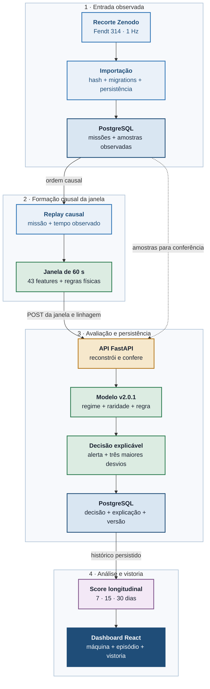
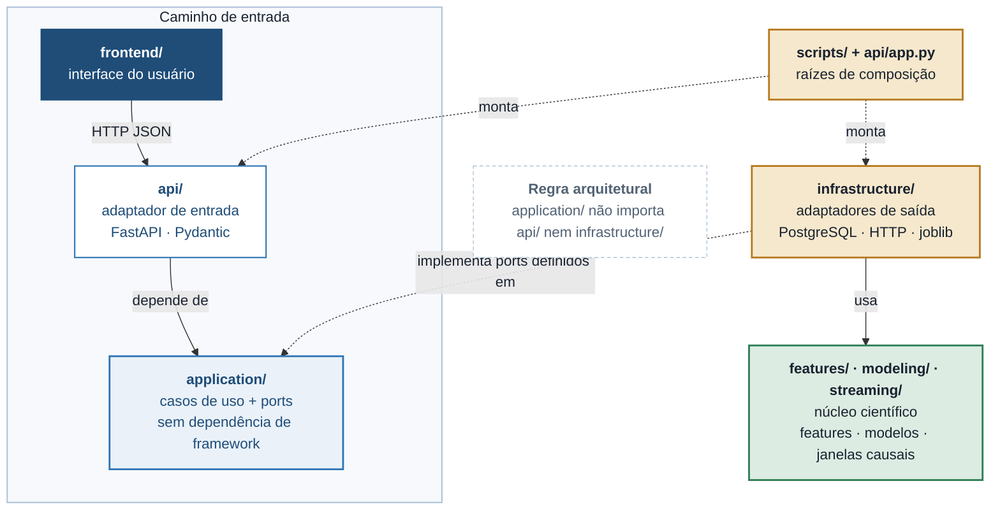

# Avaliação de Telemetria Fendt 314: Exposição Operacional Contextual para Inspeção Preventiva

**Um modelo híbrido, auditável e integrado a PostgreSQL, API e dashboard para o seguro agrícola**

Grupo SEIVA · Enterprise Challenge FIAP × Sompo Seguros · Fase 6 · Sprint 4

Karina Queiroz de Gennaro, RM 570928¹ · Luis Felipe Bardi, RM 569479¹ · Beatriz de Oliveira Ossola Ribeiro, RM 570190¹

¹ Faculdade de Informática e Administração Paulista (FIAP)

## Resumo

Este trabalho apresenta uma avaliação de telemetria de uma unidade Fendt 314
para orientar vistorias preventivas no contexto do seguro agrícola. A evidência
científica parte do histórico observado dessa unidade, publicado no dataset
aberto *Agricultural Load Cycles: Tractor Mission Profiles From Recorded GNSS
and CAN Bus Data*, da Technical University of Munich, disponível no Zenodo sob
licença CC BY 4.0. O problema tratado é
deliberadamente mais estreito do que prever dano ou sinistro: como o dataset não
possui rótulos de falha, manutenção, indenização ou mau uso, o sistema identifica
exposição operacional contextual e não uma probabilidade de perda segurada. A
telemetria é organizada em janelas causais de 60 segundos e representada por 43
variáveis agregadas. O modelo híbrido primeiro identifica três regimes de
operação por K-Means; em seguida, mede a raridade de cada janela com uma
Isolation Forest específica do regime; por fim, exige simultaneamente uma
condição física sustentada por pelo menos cinco segundos. A saída é um alerta
explicável e um score longitudinal relativo ao histórico de treino em horizontes
de 7, 15 e 30 dias. A divisão temporal usa 7.317 janelas de treino, 2.522 de
validação e 3.617 de teste posterior. A validação produziu 74 alertas (2,93%) e
68 episódios; o teste temporal consumido produziu 95 alertas (2,63%) e 79
episódios. O artefato `fendt314-hybrid-v2.0.1` está congelado e integrado a uma
cadeia executável local: importação observada, PostgreSQL, replay causal, API
FastAPI, persistência da decisão e interface React. A demonstração versionada
importa 152.561 amostras em 105 missões e reproduz 2.522 decisões. A interface
apresenta catálogo de máquinas por frota, importação de CSV, gráficos de
telemetria, exposição dos últimos 30 dias e episódios com sinais a 1 Hz. A
vistoria preserva a evidência da abertura, permite salvar achados parciais e
exige um achado por item para concluir. Novos períodos geram acompanhamento
sem alterar a vistoria anterior. CSVs simulados demonstram outras máquinas,
mantendo explícita a comparação com a referência Fendt 314. Login local e
autorização por papel distinguem administrador, especialista, vistoriador e
gestor. A contribuição é mostrar, com
rastreabilidade e limites explícitos, como um modelo não supervisionado pode
sair do experimento e orientar uma inspeção humana verificável, sem ser
apresentado como diagnóstico mecânico ou modelo atuarial.

**Palavras-chave:** Seguro Agrícola; Telemetria de Tratores; Fendt 314;
Detecção de Anomalias; K-Means; Isolation Forest; Exposição Operacional;
Inspeção Preventiva; Explicabilidade; PostgreSQL; FastAPI; Clean Architecture.

# 1. Introdução

Máquinas agrícolas concentram valor patrimonial elevado e operam sob condições
que mudam com implemento, solo, tarefa, clima e conduta operacional. Para uma
seguradora, o desafio não é apenas observar um evento depois que ele ocorreu,
mas encontrar sinais que ajudem a decidir onde uma inspeção preventiva pode
gerar mais valor. Para o gestor da frota, o problema equivalente é transformar
milhões de amostras de telemetria em uma indicação compreensível, sem exigir que
uma pessoa interprete manualmente RPM, torque, carga, patinagem e engate.

O projeto responde a esse problema com uma pergunta compatível com os dados
disponíveis: **em quais janelas a máquina apresenta uma condição física
sustentada e, ao mesmo tempo, um comportamento raro para o regime em que está
operando?** Essa formulação evita criar um alvo inexistente. Não há no dataset
uma coluna que confirme dano, quebra, manutenção ou sinistro; portanto, não há
base para treinar ou medir um classificador desses desfechos.

A solução combina conhecimento de engenharia com aprendizado não supervisionado.
As regras físicas são explícitas e auditáveis. O K-Means separa contextos de
operação. A Isolation Forest mede raridade dentro de cada contexto. O alerta só
existe quando os dois lados concordam. Em vez de usar o alerta isolado como
sentença, a aplicação agrega exposição física, tempo alertado e episódios em
7, 15 e 30 dias, sempre informando cobertura e confiança.

O modelo é o núcleo do trabalho, mas não fica isolado em um notebook. O projeto
inclui importação de dados, PostgreSQL, API, reconstrução autoritativa
das janelas, frontend e fluxo persistido de inspeção. A jornada responde, nessa
ordem: qual máquina acompanhar; quais dados entraram; como está frente à
referência; quando e o que aconteceu; o que olhar; e o que o vistoriador
encontrou. Na unidade observada, a referência vem de seu próprio histórico;
nas máquinas simuladas, ela continua sendo a referência Fendt 314. Assim, a entrega
demonstra a construção acadêmica do modelo e seu uso em uma aplicação legível
e reproduzível.

## 1.1 Evolução até a Sprint 4

O foco mudou conforme avançamos da proposta para a evidência disponível. Na
Sprint 1, em abril de 2026, o SEIVA propunha prevenir incidentes na interação
solo-água-equipamento. A arquitetura previa fontes ambientais, telemetria
simulada, cinco agentes de linguagem, XGBoost e SHAP. A entrega documentava
variáveis, cenário, hipóteses e planejamento; implementação e treinamento ainda
estavam previstos para etapas seguintes [14].

A segunda entrega, OATP, de junho de 2026, concentrou-se em risco de dano por uso
e fator de prêmio por cliente. Seu código implementava leitura canônica,
janelas, regressão logística, sobrevivência Weibull/Cox e credibilidade
Bühlmann-Straub, com EBM no diagnóstico. A avaliação separava máquinas em dados
sintéticos. Ela demonstrava o funcionamento da cadeia e a recuperação do sinal
plantado pelo gerador, sem comprovar risco ou precificação no mundo real [15].
O documento dessa etapa usa o nome OATP, sem rotular literalmente a numeração
da sprint; mantemos aqui o nome da entrega histórica.

Na Sprint 3, a telemetria observada de uma unidade Fendt 314 permitiu avaliar
comportamento operacional real, mas não os desfechos prometidos anteriormente:
a fonte não contém rótulos de dano, manutenção ou sinistro. Redefinimos então
a saída para exposição operacional contextual e inspeção preventiva. K-Means,
Isolation Forest por regime e regras físicas substituem a cadeia atuarial na
inferência atual. O resultado orienta uma vistoria e não calcula prêmio.

Na Sprint 4, correspondente à Fase 6, consolidamos o modelo da Sprint 3 em um
fluxo de produto para inspeção preventiva. O painel inicial de frotas e
prioridades sugeria uma comparação entre máquinas que os dados observados não
sustentavam. A jornada atual acompanha uma máquina: entrada de dados, análise,
episódio, pauta, achados e novo período. A frota organiza o catálogo e o acesso;
as máquinas adicionais da demonstração usam dados simulados claramente
identificados. O especialista decide abrir o caso e o vistoriador registra o
que encontrou. Achados reais poderão sustentar a futura avaliação da pauta e
do modelo. Esta entrega também reúne login por identificação do trabalhador,
quatro papéis de acesso e histórico administrativo das alterações. O bundle
`fendt314-hybrid-v2.0.1` e sua avaliação temporal permanecem os mesmos; a
evolução desta etapa está na aplicação, no acompanhamento e na experiência de
uso, sem apresentar a ampliação da interface como nova validação científica.

Mantivemos prevenção, telemetria, janelas, explicações e rastreabilidade. A
mudança central foi alinhar a decisão oferecida ao que a evidência permite
medir. As referências [14] e [15] identificam por commit os documentos e o
código das primeiras entregas. A Sprint 3 é a base científica e executável da
continuidade apresentada nesta Sprint 4.

# 2. Caracterização Quantitativa

O dataset de origem reúne 1.245 horas de operação de cinco tratores, com GNSS de
alta resolução e dados dos barramentos J1939 e ISOBUS [1]. Este projeto seleciona
o arquivo do Fendt 314 e trata o histórico observado dessa unidade como referência
científica. A origem temporal absoluta foi recuperada por três âncoras
independentes presentes nos arquivos de transporte. As três convergiram para o
mesmo epoch UTC, permitindo reconstruir aproximadamente 226 horas, 80 dias com
telemetria e 555 missões entre abril e dezembro de 2024.

A separação experimental é cronológica, nunca aleatória por janela. Treino e
validação orientam seleção e congelamento; o teste representa um período
posterior e foi aberto uma única vez. A Tabela 1 resume o censo utilizado.

| Conjunto | Intervalo | Missão analítica | Janelas | Resultado principal |
|---|---|---|---:|---|
| Treino | 26/04 a 30/08/2024 | ajustar pré-processamento, regimes, detectores e baseline | 7.317 | referência aprendida |
| Validação | 07/09 a 19/10/2024 | selecionar pelos gates predefinidos | 2.522 | 74 alertas; 68 episódios |
| Teste temporal | 21/10 a 04/12/2024 | avaliação final posterior | 3.617 | 95 alertas; 79 episódios |
| Demo versionada | 07/09 a 19/10/2024 | provar execução ponta a ponta | 152.561 amostras; 105 missões | 2.522 janelas; 74 alertas |

**Tabela 1.** Divisão temporal, finalidade e volume da evidência utilizada.

Na validação, 40,40% das janelas satisfizeram ao menos uma regra física e 7,26%
dessas janelas também ultrapassaram o limiar de raridade contextual. A fração
final de alertas foi 2,93%. No teste posterior, a elegibilidade física foi
22,59%, a retenção contextual foi 11,63% e a fração final de alertas foi 2,63%.
Três famílias de condições físicas apareceram nos dois períodos.

Esses resultados não são taxa de acerto para dano. Eles medem estabilidade de
um detector híbrido sob critérios operacionais definidos antes da abertura do
teste. A ausência de um alerta também não significa operação segura: pode
significar apenas que não houve evidência suficiente naquela janela.

# 3. Personas

A solução atende três papéis no processo preventivo: o especialista da
seguradora decide se abre uma vistoria; o vistoriador segue a pauta e registra
achados; o gestor conversa com o operador sobre trechos concretos. A evidência
observada é de uma única máquina, comparada com seu próprio histórico, sem
ranking entre tratores. Outras frotas e máquinas demonstram o fluxo com dados
simulados, sem ampliar a evidência científica. O operador individual não recebe nota e não é uma
persona avaliada pelo sistema. Um administrador gerencia o acesso à POC e lê
as visões de todos os papéis, sem substituir essas três personas na vistoria.

## 3.1 Ana Martins, analista de riscos e inspeções na seguradora

**Contexto.** Ana trabalha na área técnica de seguros para máquinas agrícolas.
Na POC, ela examina a unidade Fendt 314 observada e decide se os episódios
justificam uma vistoria ou acompanhamento preventivo.

**Dores.** A telemetria bruta é volumosa e difícil de comparar. Um simples
limiar de RPM ou torque gera alarmes fora de contexto, enquanto um modelo
caixa-preta não permite explicar por que um episódio merece atenção. Além disso,
Ana não pode tratar um padrão operacional como dano confirmado ou usar um score
experimental para negar cobertura.

**Necessidades.** Uma indicação rastreável até as amostras observadas; regras e
limiares versionados; explicação das variáveis que tornaram a janela rara;
visões de 7, 15 e 30 dias com cobertura; e um fluxo em que a decisão final
continua humana.

## 3.2 Marta Costa, vistoriadora

**Contexto.** Marta recebe um caso aberto pela especialista. Antes da visita,
consulta a pauta e os episódios que motivaram cada item; em campo, verifica o
equipamento e registra o que encontrou.

**Dores.** Um alerta estatístico sem sinal observado nem ligação com um
componente não orienta uma inspeção. Sem um registro estruturado, também não é
possível avaliar depois se a pauta foi útil.

**Necessidades.** Sinais e regras segundo a segundo, uma pauta congelada para o
caso e exatamente um achado por item, inclusive quando não foi possível
verificá-lo. A pauta é hipótese de engenharia e não substitui seu julgamento.

## 3.3 Carlos Mendes, cliente segurado e gestor de frota

**Contexto.** Carlos responde pela operação de máquinas agrícolas e pela
interlocução com a seguradora. Nesta POC, há telemetria de apenas uma unidade
Fendt 314; sua conta só pode consultar as máquinas vinculadas à sua frota.

**Dores.** Ele recebe muitos dados, mas pouca informação acionável. Alertas sem
contexto confundem trabalho pesado legítimo com exposição atípica. Também não
quer um sistema de vigilância de operadores nem uma pontuação que pareça acusar
mau uso sem inspeção.

**Necessidades.** Uma visão clara de quando, por quanto tempo e em qual regime
uma condição ocorreu; histórico persistido por máquina; evidência suficiente
para planejar uma inspeção; e linguagem que diferencie alerta preventivo de
diagnóstico de falha.

# 4. Arquitetura Proposta

A arquitetura foi desenhada para manter contratos e decisões de aplicação
separados de HTTP, ORM, banco e formato do arquivo. O projeto não adiciona um
modelo DDD completo: usa uma *clean architecture* pragmática, suficiente para
deixar a IA testável e trocar os adaptadores externos sem duplicar a regra de
negócio.

## 4.1 Clean Architecture

As responsabilidades são organizadas em cinco áreas:

- **`features/`, `modeling/` e `streaming/`:** núcleo científico que define o
  esquema de 43 features, regimes, raridade, regras híbridas, agregação
  longitudinal, replay e formação causal das janelas.
- **`application/`:** contratos imutáveis, *ports* e casos de uso para cadastro,
  ingestão de janelas, consulta da máquina e inspeções.
- **`infrastructure/`:** adaptadores de arquivo, PostgreSQL, replay persistido,
  modelo congelado e cliente HTTP.
- **`api/`:** validação do transporte, autenticação, autorização por papel,
  rotas FastAPI e composição das dependências por requisição.
- **`frontend/`:** apresentação React para login, catálogo por frota, importações,
  gráficos da máquina, episódios, vistorias e administração de contas.

A aplicação conhece apenas os *ports*. O modelo congelado implementa
`UsageModel`; os repositórios PostgreSQL implementam os contratos de
persistência. FastAPI e SQLAlchemy ficam nos limites externos. Essa separação
permite testar o caso de uso com objetos em memória e testar os adaptadores com
um banco real.

A composição executável mantém apenas o PostgreSQL em Docker, usando a imagem
oficial sem customização. O comando `make demo-real` espera o banco ficar
saudável e executa `scripts/demo_real.py` no host. O script valida os artefatos,
aplica migrations, importa a telemetria, inicia FastAPI e Vite e realiza o
replay pela API. Essa opção reduz a infraestrutura necessária e deixa explícita
a integração entre dados, modelo, backend e frontend.

O progresso do replay é efêmero e mantido em memória pelo processo da
demonstração, disponível pela API e pelo terminal. Janelas, decisões, explicações e casos de inspeção continuam
persistidos exclusivamente no PostgreSQL.

## 4.2 Fluxo de Dados Ponta a Ponta

O caminho de reprodução científica começa no recorte observado do Zenodo. A importação persiste
missões e amostras em uma transação. O replay lê apenas o PostgreSQL e constrói
janelas causais. Cada janela pronta é enviada por HTTP para a API. O servidor
não confia cegamente nas 43 features recebidas: reconstrói a janela a partir das
amostras persistidas, compara todos os valores e só então chama o bundle. A
decisão e sua explicação são persistidas antes de aparecer no progresso da demo
ou no dashboard (Figura 1).



**Figura 1.** Fluxo de reprodução da telemetria observada ao dashboard. A
entrada operacional por CSV usa o mesmo bundle e é descrita na seção 4.6.



**Figura 2.** Direção das dependências entre composição, adaptadores,
aplicação e núcleo científico.

## 4.3 Componentes e Contratos

| Componente | Contrato principal | Responsabilidade |
|---|---|---|
| Composição | `make demo-real` | iniciar PostgreSQL e executar a demonstração local |
| Orquestração | `scripts/demo_real.py` | validar, migrar, cadastrar, importar, servir, reproduzir e verificar |
| Importação | `ImportTelemetryUseCase.execute()` | validar origem, persistir import, missões e amostras atomicamente |
| CSV pela interface | `import_operational_csv()` | validar amostras e origem, executar o bundle e persistir a importação e suas decisões em uma transação |
| Replay | `PostgresTelemetryReplay.iter_samples()` | ler telemetria persistida em ordem causal |
| Janela | `CausalWindowAggregator.ingest()` | produzir `READY` ou `NO_DATA` sem usar o futuro |
| Transporte | `POST /v1/tractors/{id}/windows` | receber uma alegação de janela observada |
| Verificação | `resolve_observed_window()` | reconstruir a janela no servidor e rejeitar divergências |
| Modelo | `UsageModel.score()` | produzir regime, raridade, regra e alerta explicável |
| Persistência | `insert_window()` | gravar janela e decisão na mesma transação |
| Agregação | `UsageModel.aggregate()` | calcular exposição relativa em 7, 15 e 30 dias |
| Evidência do episódio | `GetEpisodeDetailUseCase` | reprocessar as amostras gravadas com a mesma função da ingestão e conferir os segundos persistidos |
| Pauta de vistoria | `build_inspection_agenda()` | ligar condições observadas a componentes a inspecionar (`inspection-checklist-v1`) |
| Inspeção | casos de uso de `inspection_cases` | congelar evidência e pauta, salvar achados parciais e concluir com um achado por item |
| Acompanhamento | `inspection_workflow()` | identificar caso ativo, última conclusão e episódios novos após a evidência revisada |
| Login e acesso | `POST /v1/auth/login`, sessão e papéis | autenticar pessoas e limitar consultas e ações por papel e frota |
| Apresentação | API + interface React | expor catálogo, importações, gráficos, episódios, vistorias e administração |
| Progresso | `InMemoryReplayProgress` | projetar a execução atual sem substituir a evidência persistida |

**Tabela 2.** Componentes executáveis e contratos do caminho principal.

O contrato HTTP de replay observado exige `telemetry_import_id`, split `train` ou `validation` e
proveniência `observed_dataset_replay`. Payload inválido recebe HTTP 422;
linhagem ou conteúdo divergente, 409; criação, 201; repetição idêntica, 200. A
concorrência é serializada por lock do trator e a idempotência combina modelo,
trator, import, missão, janela e timestamp.

## 4.4 Login e Controle de Acesso

As contas da POC são criadas localmente no PostgreSQL, sem cadastro público. O
número de trabalhador é um identificador textual único de 1 a 20 dígitos, para
preservar zeros à esquerda. Não há conferência com cadastro de RH. A senha é
armazenada como hash `scrypt` com salt. No login, a API cria uma sessão de oito
horas e devolve ao navegador um cookie `HttpOnly`, `SameSite=Lax`, com valor
aleatório opaco. O banco guarda apenas o hash desse valor. A cada requisição
protegida, a API verifica validade, revogação e estado da conta. O logout revoga
a sessão atual; troca de senha, mudança de papel ou desativação revogam todas
as sessões da conta. A sessão opaca permite que essas alterações de acesso
tenham efeito na próxima requisição, usando o PostgreSQL já presente na POC.
O cookie recebe `Secure` quando `AUTH_COOKIE_SECURE=1` é
configurado para uso com HTTPS.

O primeiro administrador é criado no terminal. Ele consulta todas as máquinas,
importações e casos. Na tela `/admin`, gerencia contas e consulta o histórico de
mudanças de acesso; no detalhe da vistoria, consulta o histórico do caso.
Pode criar contas e administrar papel, frota, senha e ativação; uma
senha temporária gerada pela API é exibida uma única vez. As ações de vistoria
continuam atribuídas aos papéis operacionais.

| Papel | Consultas e ações permitidas |
|---|---|
| Administrador (`ADMIN`) | consulta todas as máquinas, importações, casos e históricos de ações; gerencia contas; ações operacionais seguem nos respectivos papéis |
| Especialista (`INSURER`) | cadastra frotas e máquinas, importa CSVs e consulta evidências; abre, atribui, atualiza e cancela casos |
| Vistoriador (`INSPECTOR`) | consulta máquinas, episódios e casos; inicia a vistoria, salva achados parciais e conclui com resultado |
| Gestor (`FLEET_MANAGER`) | consulta máquinas, telemetria e episódios da própria frota; não acessa casos, importações nem históricos de ações |

As permissões da POC são aplicadas no backend; a interface apenas apresenta as
ações correspondentes.

O especialista e o vistoriador têm visibilidade global das máquinas nesta POC.
O responsável é opcional e selecionado entre os vistoriadores ativos cadastrados.
A atribuição não restringe a autorização a esse vistoriador: outros vistoriadores
também podem trabalhar no caso. Rotas protegidas sem sessão recebem HTTP 401; ações
fora do papel, 403; máquinas de outra frota retornam 404 ao gestor. O replay
envia janelas com um token de serviço separado da sessão de pessoa. Essa identidade
local sustenta a demonstração, mas uma implantação externa exige identidade
corporativa, HTTPS e gestão operacional de segredos.

## 4.5 Trilha de Ações da Vistoria

Cada abertura ou alteração de um caso pela API autenticada acrescenta, na
mesma transação, um evento com o número e o papel do trabalhador no momento
da ação, horário UTC, ação, versão e estados anterior e posterior. Somente o
administrador consulta esse histórico no caso. As alterações de
contas feitas pelo administrador na interface também registram autor, horário
e ação. O método e a validação do modelo ficam na documentação; a tela de
auditoria técnica foi retirada da interface. Na POC, a trilha não inclui
leituras, logins ou comandos locais de gestão de usuários.

## 4.6 Entrada de Dados e Ciclo de Acompanhamento

O produto segue seis etapas, com uma decisão humana entre o resultado do modelo
e a execução da vistoria:

| Etapa | Ação e resultado |
|---|---|
| 1. Escolher a máquina | o especialista cadastra a frota e a máquina; o catálogo também mostra unidades ainda sem dados |
| 2. Importar dados | envia um CSV e confere período, sinais e cobertura na prévia antes de processar |
| 3. Executar o modelo | o servidor valida as amostras, forma janelas causais de 60 s, executa o bundle congelado e persiste as decisões |
| 4. Examinar o resultado | gráficos mostram telemetria, três medidas comparadas com a referência, semanas e episódios por condição |
| 5. Realizar a vistoria | o especialista abre o caso; o vistoriador consulta a pauta e os gráficos, salva achados e conclui com resultado |
| 6. Acompanhar novos dados | uma importação posterior identifica episódios novos; a conclusão anterior mantém seus achados e sua evidência |

O CSV contém sensores, sem escores ou alertas prontos. A inferência executa o
modelo treinado; a importação não retreina o bundle. O contrato operacional
aceita UTF-8, até 12 MB e 20.000 amostras, com timestamps UTC em segundos
inteiros, 17 sensores válidos e frequência de 1 Hz dentro de cada missão. Um
novo período deve começar depois do último dado importado. A repetição do mesmo
conteúdo na mesma máquina é idempotente.

Há três origens explícitas: `observed_dataset_replay` para o recorte científico,
`simulated_csv` para as novas máquinas de demonstração e `operational_csv` para
novos períodos da unidade já vinculada à referência observada. As máquinas com
dados simulados exibem essa condição e usam a referência Fendt 314; não possuem
um modelo próprio treinado. O cadastro de uma nova unidade real, por si só, não
valida sua interpretação. É necessário verificar identidade, sinais e referência
antes de habilitar esse uso. Dados reais e simulados ficam em máquinas separadas.

Na página Telemetria, o gráfico permite escolher a missão e solicita até 300
pontos amostrados; a API aceita até 1.000 pontos por consulta. No episódio, os
sinais permanecem a 1 Hz. O caso de
vistoria usa sua data de evidência congelada, inclusive ao consultar o episódio,
para que novas importações não alterem o fundamento de uma decisão anterior.

As migrations `0008_operational_telemetry` e `0009_inspection_drafts` persistem,
respectivamente, a origem e o autor da importação operacional e os achados
parciais da vistoria. A seção 5.7 detalha a passagem da evidência para a vistoria.

# 5. Modelagem, Hibridização e Avaliação

A modelagem foi construída para responder a uma pergunta sem rótulo de dano.
Cada componente recebe uma função distinta: caracterizar o contexto, medir
raridade, aplicar conhecimento físico e resumir a exposição no tempo (Tabela 3).

| Componente | Método | Papel | Motivo da escolha |
|---|---|---|---|
| Pré-processamento | mediana + `RobustScaler` | preparar as 43 features | reduzir efeito de ausências e escalas distintas usando apenas treino |
| Regimes | K-Means, 3 grupos | contextualizar a operação | evita comparar diretamente trabalhos operacionais diferentes |
| Raridade | Isolation Forest por regime | medir atipicidade | método não supervisionado adequado à ausência de rótulos [2] |
| Regras físicas | cinco condições versionadas | exigir relevância operacional | torna o motivo do alerta explícito e auditável |
| Detector híbrido | regra física AND raridade | emitir alerta | reduz alarmes puramente estatísticos ou puramente limiares |
| Longitudinal | percentis empíricos de treino | resumir 7/15/30 dias | produz comparação relativa sem inventar probabilidade de dano |

**Tabela 3.** Componentes da modelagem e justificativa metodológica.

## 5.1 Janelas Causais e Features

Cada missão é dividida em janelas de 60 segundos. A primeira amostra da janela
usa somente o predecessor causal necessário para calcular variações de um
segundo; nenhuma amostra futura participa. Uma janela é `READY` quando possui
cobertura suficiente e contexto causal; caso contrário, vira `NO_DATA` e não é
pontuada.

O modelo recebe 43 features: média e desvio-padrão de 17 sinais de estado (34
colunas) e média, desvio-padrão e máximo de três sinais transitórios (9
colunas). Identidade, tempo, split, trabalho, modelo de trator, temperatura de
saúde e durações das regras físicas são excluídos das features aprendidas. Essa
separação evita *leakage* e impede que a regra que autoriza o alerta seja também
o atalho pelo qual o modelo aprende raridade.

## 5.2 Regimes Operacionais por K-Means

O experimento compara K-Means e Gaussian Mixture entre três e oito componentes,
com cinco sementes. Todos os ajustes usam apenas treino. A validação exige
silhueta mínima de 0,20, estabilidade ARI mínima de 0,75, pelo menos 1% do treino
em cada grupo e ao menos três dimensões interpretáveis por regime. Entre os
candidatos aprovados, vence aquele com maior estabilidade e silhueta. O artefato
congelado selecionou K-Means com três regimes. O método deriva do problema de
particionamento formulado por MacQueen [3].

O regime não é uma classe de risco nem um tipo de trabalho rotulado. Ele é um
contexto estatístico para evitar que, por exemplo, uma janela de esforço com
implemento seja comparada diretamente a uma janela de deslocamento leve.
Para leitura humana, `regime-labels-v1` denomina os três grupos como campo com
levante trabalhando, campo com TDP em carga variável e deslocamento. Esses
nomes são uma camada de interpretação versionada fora do bundle, sem mudar
regimes ou limiares aprendidos.

## 5.3 Raridade Contextual por Isolation Forest

Depois do pré-processamento e da atribuição de regime, uma Isolation Forest com
300 árvores é ajustada para cada grupo. O score de raridade é o negativo de
`score_samples`, de forma que valores maiores indiquem maior atipicidade. O
limiar de cada regime é o quantil 0,97 de seus escores no treino. A validação
nunca recalibra o limiar.

A explicação contextual usa a mediana e o intervalo interquartil do treino no
regime. Para uma janela alertada, o sistema retorna as três features com maior
desvio robusto, `|x − mediana| / IQR`. Essa medida é um substituto
interpretável calculado fora da floresta: ela não deriva dos caminhos de
isolamento das árvores e, portanto, não é a atribuição interna do Isolation
Forest. Também não explica causalidade. Ela indica quais dimensões mais se
afastaram da referência do regime e, por isso, o dashboard a apresenta como
pista para a conversa com o operador, não como o motivo do alerta.

## 5.4 Regras Físicas e Alerta Híbrido

As regras são calculadas amostra a amostra e acumuladas em segundos dentro da
janela. Uma condição torna a janela fisicamente elegível quando dura pelo menos
cinco segundos (Tabela 4).

| Condição | Regra por amostra |
|---|---|
| *Lugging* | `600 ≤ RPM < 1400` e carga do motor `> 70%` |
| Sobrecarga de torque | carga `> 90%` e torque atual `> 85%` |
| Patinagem sob carga | carga `> 50%`, patinagem `> 20%` e velocidade no solo `≥ 0,5 m/s` |
| Térmica sob carga | carga `> 70%` e temperatura do arrefecimento `≥ 95 °C` |
| Subida brusca de torque | variação de torque em 1 s `≥ 35` e carga `> 70%` |

**Tabela 4.** Regras físicas versionadas usadas pelo detector híbrido.

Formalmente:

```text
elegível_física = duração_de_qualquer_regra ≥ 5 segundos
raridade_contextual = score_do_regime ≥ quantil_0,97_do_treino
alerta_híbrido = elegível_física AND raridade_contextual
```

As regras são hipóteses de engenharia. Elas tornam o alerta observável e
auditável, mas não provam abuso, desgaste, dano ou falha.

## 5.5 Score Longitudinal

O sistema mede três taxas por hora observada:

- segundos de exposição física por hora;
- segundos de exposição alertada por hora;
- episódios de alerta por hora.

Cada taxa é convertida em percentil contra a distribuição empírica de treino do
mesmo horizonte. O score relativo é a média simples dos três percentis:

```text
score_relativo = média(
  percentil_exposição_física,
  percentil_exposição_alertada,
  percentil_episódios
)
```

O resultado varia de 0 a 100 e significa posição relativa no histórico de
treino, não probabilidade de sinistro. A confiança depende da cobertura de
calendário, isto é, da fração de dias do horizonte com alguma operação
observada: abaixo de 25%, `LOW`; de 25% até menos de 60%, `MEDIUM`; a partir de
60%, `HIGH`. Ausência de telemetria produz `NO_DATA`, nunca zero exposição.

Para leitura, o score recebe uma faixa versionada (`exposure-bands-v1`): abaixo
de 25, `BELOW_TYPICAL`; de 25 até menos de 75, `TYPICAL`; 75 ou mais,
`ABOVE_TYPICAL`. Os cortes marcam o primeiro e o último quarto da escala de
percentis e não foram calibrados contra desfecho; são uma convenção de
apresentação que pode mudar de versão sem alterar o modelo.

## 5.6 Avaliação e Resultados

| Métrica | Validação | Teste temporal consumido |
|---|---:|---:|
| Janelas | 2.522 | 3.617 |
| Janelas fisicamente elegíveis | 40,40% | 22,59% |
| Retenção pela raridade | 7,26% | 11,63% |
| Alertas | 74 (2,93%) | 95 (2,63%) |
| Episódios | 68 | 79 |
| Episódios por hora observada | 1,618 | 1,311 |
| Famílias físicas representadas | 3 | 3 |
| Explicações completas | sim | sim |
| Decisão | GO | GO final |

**Tabela 5.** Evidência temporal congelada do modelo híbrido.

O teste foi consumido uma única vez. Reexecutá-lo verifica o software, mas não
cria nova evidência de generalização. A aplicação carrega somente o bundle cujo
SHA-256, tamanho, versão, esquema de features e parâmetros coincidem com o
manifesto. O arquivo atual possui 2.921.962 bytes e SHA-256
`24b39996b3d0016f2bb29c6d722a24c46ac90576aab3da78cf44acdbad9cf5a4`.

## 5.7 Da Evidência à Vistoria

O modelo termina no score. A camada de aplicação e a interface organizam o
resultado para uma vistoria verificável, sem alterar bundle, features ou
limiares.

**Episódio com definição única.** Janelas alertadas consecutivas da mesma
missão formam um episódio. Um episódio pertence ao horizonte de 30 dias quando
o fechamento da sua primeira janela cai dentro do horizonte. É a mesma regra
usada pela contagem `hybrid_episode_start` do score, de modo que a lista de
episódios e o número exibido no resumo coincidem.

**Cobertura no tempo.** A linha do tempo agrupa exposição e episódios por
semana UTC. Sem operação observada, a semana aparece como `NO_DATA`; com menos
de uma hora, sua marca visual é tracejada para explicitar a baixa cobertura.
No resumo, a faixa dos últimos 30 dias aparece junto do número de dias com
operação e da tendência em relação aos 30 dias anteriores.

**Evidência segundo a segundo.** Ao abrir um episódio, a API relê as amostras
gravadas no PostgreSQL e reaplica a mesma função de ingestão
(`derive_sample_record`) que produziu as regras físicas. Os segundos
recalculados por janela precisam coincidir com os persistidos; se divergirem, a
API responde 409 em vez de mostrar um gráfico inconsistente. Na validação real,
os 68 episódios foram reprocessados sem divergência.

**Pauta de vistoria.** Cada condição observada é ligada aos componentes que ela
mais solicita. Por exemplo, a baixa rotação sob carga leva a motor, embreagem e
transmissão, e prática de operação. O catálogo `inspection-checklist-v1` tem
oito componentes. Ele é uma hipótese de engenharia ainda não validada por
vistoriadores. Um item só aparece quando a sua condição ocorreu, junto com os
episódios que o motivaram. Ao abrir um caso, a pauta é congelada no snapshot
`inspection-evidence-v2`, com hash.
O vistoriador inicia o caso e pode salvar os achados parciais para retomá-lo.
Resultado e observação geral são enviados apenas na conclusão.
Para concluir o caso, o vistoriador registra um achado por item (`OK`,
`ATTENTION`, `PROBLEM` ou `NOT_CHECKED`), e os itens com atenção ou problema
exigem descrição. Uma nova vistoria só pode ser aberta quando não há caso ativo
e existem episódios novos no horizonte atual de 30 dias, posteriores à data da
evidência da última conclusão. A pauta do novo caso contém esses episódios.

Achados obtidos em vistorias físicas podem formar os primeiros rótulos de campo.
Os preenchimentos das máquinas simuladas são registros de demonstração e não
validam a pauta nem o modelo. Com volume de achados reais suficiente, será
possível confirmar ou corrigir a pauta e, mais
adiante, para avaliar se o score antecipa problemas encontrados.

# 6. Dados, Dispositivos e Variáveis

## 6.1 Fonte e Aquisição

Götz e colaboradores instrumentaram cinco tratores, de 77 a 240 kW, em uma
fazenda no sul da Alemanha. Os pesquisadores registraram GNSS de alta resolução,
dados do barramento de motor J1939 e do ISOBUS, além de informações sobre
modelos e implementos [1]. O conjunto público totaliza aproximadamente 2,8 GB;
o arquivo `Fendt 314.zip` possui cerca de 1,1 GB.

O projeto não lê J1939 ao vivo. Ele usa o CSV consolidado publicado para o
Fendt 314, convertido para um contrato canônico de 1 Hz. Essa diferença é
importante: os sinais têm origem em barramentos reais, mas o runtime atual
recebe arquivo canônico ou replay do PostgreSQL, não frames CAN de uma máquina
conectada.

## 6.2 Reconstrução Temporal

O CSV consolidado contém `Time_(s)` como duração global, sem timestamp absoluto.
Três arquivos de transporte preservam UTC e foram alinhados por sequências
multivariadas de posição, RPM, torque, velocidade e tipo de trabalho. As três
âncoras produziram a mesma origem:

```text
epoch_utc = 2024-04-26T13:22:25.100Z
observed_at_utc = epoch_utc + Time_(s)
```

A coincidência ocorre na resolução original de 0,1 segundo. O tempo decorrido é
preservado para auditoria. A reconstrução estabelece quando o sinal foi
observado, mas não acrescenta qualquer rótulo de dano ou manutenção.

## 6.3 Catálogo de Variáveis

| Grupo | Sinais usados na janela | Estatísticas do modelo |
|---|---|---|
| Motor e comando | RPM, torque atual, carga, acelerador | média e desvio-padrão |
| Movimento e implemento | eixo dianteiro, velocidade sobre o solo, velocidade do implemento, roda, PTO traseira | média e desvio-padrão |
| Engate e esforço | posição e estado do engate, força do elo, *draft* traseiro | média e desvio-padrão |
| Velocidades da máquina | velocidade no solo, selecionada e da roda | média e desvio-padrão |
| Dinâmica | patinagem | média e desvio-padrão |
| Transientes | subida de torque, mudança de RPM e mudança de velocidade em 1 s | média, desvio-padrão e máximo |

**Tabela 6.** Formação das 43 features do contrato `usage_context_v2`.

O contrato bruto ainda carrega temperatura do arrefecimento para a regra
térmica e campos de identidade para rastreabilidade. Eles não entram no vetor de
43 features aprendido. No pré-processamento do recorte observado, os valores
são validados contra faixas físicas antes da agregação; leituras inválidas
viram ausência e são imputadas somente na fronteira do modelo com a mediana
de treino. Já o CSV operacional exige sensores finitos nas faixas aceitas e
rejeita o arquivo inválido antes de processá-lo.

## 6.4 Critérios de Aceite e Hipóteses

| Gate | Critério |
|---|---|
| Integridade da fonte | tamanho, SHA-256 dos bytes e digest semântico devem coincidir |
| Causalidade | replay e janelas não podem usar amostras futuras |
| Regimes | silhueta `≥ 0,20`, estabilidade ARI `≥ 0,75` e fração mínima de treino `≥ 1%` |
| Detector | limiares ajustados somente no treino e explicações completas |
| Alerta | regra física `≥ 5 s` e raridade acima do limiar do regime |
| API observada | toda janela precisa de import persistido e comparação integral das features |
| Persistência | decisão, explicação, versão e proveniência na mesma transação |
| Demo | 152.561 amostras, 105 missões, 2.522 janelas e 74 alertas |
| Software | suítes Python e frontend, integração PostgreSQL, lint, typecheck e build aprovados |

**Tabela 7.** Principais critérios de aceite científico e de software.

As hipóteses centrais são que regimes reduzem comparações fora de contexto, que
raridade condicionada ao regime filtra parte das regras físicas comuns e que
episódios são mais úteis para inspeção do que alertas isolados. O experimento
mostra consistência temporal dessas hipóteses no histórico estudado; ainda não
mede associação com desfechos mecânicos ou financeiros.

# 7. Cenário Ilustrativo

## 7.1 Episódio do Recorte Observado

Durante a reprodução real da validação, a missão 331, janela 5, iniciada em
`2024-09-30T17:34:10.100Z`, foi classificada no regime operacional 2. A janela
acumulou 19 segundos de sobrecarga de torque, cinco segundos de subida brusca de
torque e 22 segundos de exposição física total. O score de raridade contextual
foi 0,6276, acima do limiar 0,5722 daquele regime. Como a condição física
sustentada e a raridade ocorreram juntas, o modelo emitiu alerta.

A explicação apontou como maiores desvios robustos a média da mudança de
velocidade em um segundo, a média da mudança de RPM em um segundo e o máximo da
mudança de RPM. Esses valores não dizem que o trator sofreu dano. Eles dizem que
a combinação observada foi fisicamente relevante pelas regras versionadas e
estatisticamente incomum dentro do contexto aprendido.

No fluxo de negócio, Ana abre a máquina e vê primeiro a faixa dos últimos 30
dias, com a cobertura em dias, a tendência frente aos 30 dias anteriores e a
evolução semana a semana. Ao abrir o episódio, ela vê a rotação, a carga, o
torque e os demais sinais segundo a segundo, com
os trechos em que cada regra física estava ativa. Se a exposição for recorrente
e houver cobertura suficiente, ela abre um caso de vistoria. A pauta congelada
indica o que olhar: neste episódio, motor, admissão de ar e arrefecimento, pela
sobrecarga de torque; embreagem, transmissão, cardã e TDP, pela subida brusca de
torque. O vistoriador registra um achado por item, e o caso termina como
`NO_ACTION`, `MONITOR` ou `MAINTENANCE_RECOMMENDED`. Nenhuma
dessas etapas registra culpa, confirma sinistro ou altera automaticamente preço
e cobertura.

## 7.2 Demonstração da Jornada do Produto

O vídeo da entrega acompanha a máquina Campo 01, da Frota Campo Claro, em uma
base isolada. Os dois CSVs são simulados e contêm uma hora de sensores a 1 Hz
cada. O modelo congelado processa as amostras e calcula os alertas. O primeiro
período gerou dois episódios; o especialista abriu uma vistoria e o vistoriador
salvou e concluiu seis achados de demonstração. O segundo CSV, de um período
posterior, gerou dois episódios novos, mantendo o caso anterior e seus achados.

A gravação também mostra o gestor limitado à própria frota e o administrador
consultando contas e o histórico das ações. A narrativa demonstra o caminho
**dados → inferência → gráficos → vistoria → acompanhamento**. Os achados do
vídeo foram preenchidos para demonstrar o sistema; não são observações de uma
inspeção física nem evidência de eficácia do modelo.

O vídeo da entrega está disponível no
[YouTube](https://youtu.be/ZLmSHQjQImI). A
demonstração observada do `make demo-real` permanece separada desse cenário.

# 8. Governança e Conformidade

A governança é tratada em quatro frentes. Primeiro, **proveniência**: cada
decisão referencia import, split, hash semântico, trator, missão, janela, versão
do modelo e fingerprint do conteúdo. A API reconstrói a janela no servidor, o
que impede que um cliente associe features arbitrárias a uma origem legítima.

Segundo, **governança do modelo**: treino, validação e teste seguem a ordem
temporal; o teste está marcado como consumido; o bundle é imutável e verificado
por hash; e as regras físicas permanecem fora do vetor aprendido. Mudanças de
features, limiar, regras ou baseline exigem nova versão e nova avaliação.

Terceiro, **uso responsável no seguro**: o score é evidência para prevenção e
vistoria. Não deve decidir sozinho prêmio, cobertura, recusa de indenização,
culpa ou mau uso. Produção atuarial exigiria dados de múltiplas unidades,
desfechos confirmados, análise de viés, validação prospectiva e governança
regulatória própria.

Quarto, **privacidade e segurança**: o recorte público utilizado não contém
identidade pessoal declarada e o contrato atual não avalia operador. Em uma
implantação real, telemetria de equipamento pode se tornar dado associado a
pessoas ou empresas; seriam necessários base legal, transparência, minimização,
retenção e controles compatíveis com a LGPD [10]. A POC local usa contas no
PostgreSQL identificadas por número de trabalhador, senhas protegidas por hash,
sessões revogáveis em cookie `HttpOnly` e autorização por papel. O especialista
pode abrir e gerir casos; o vistoriador registra achados; o gestor consulta
apenas as máquinas da sua frota. A ingestão
de janelas usa um token de serviço separado. PostgreSQL, API e frontend escutam
somente em `127.0.0.1`. Esses controles locais não autorizam exposição externa
sem identidade corporativa, HTTPS e gestão operacional de segredos.

# 9. Conclusão

Este trabalho demonstrou uma avaliação de telemetria do Fendt 314 baseada em
dados observados e em uma cadeia completa de IA aplicada. O modelo combina
regimes K-Means, raridade por Isolation Forest e cinco regras físicas
versionadas. A decisão é explicável, causal e agregada em horizontes de 7, 15 e
30 dias. A validação temporal produziu 74 alertas em 2.522 janelas e o teste
posterior, 95 em 3.617, preservando três famílias físicas e explicações
completas.

A contribuição é conectar exposição contextual, evidência persistida, uma
interface por papel e a decisão humana de inspeção. O cadastro e a importação
de CSV permitem demonstrar novas máquinas; os achados e o acompanhamento
fecham a jornada após a análise. A validação do replay em PostgreSQL descartável importou 152.561
amostras observadas, executou o bundle congelado e reproduziu 2.522 decisões
por HTTP. O fluxo integrado é orquestrado por `make demo-real`: somente o banco
usa Docker; API, replay e frontend rodam localmente. Os achados estruturados
fornecem o caminho para validar a pauta e, no futuro, confrontar o score com o
que foi encontrado em campo.

O resultado atual é válido para o histórico de uma unidade Fendt 314. Levar a
solução a uma frota real requer novas unidades, telemetria própria por trator e
validação externa. Essa limitação não reduz o valor da POC; define com precisão
qual problema ela já resolve e qual evidência ainda precisa ser construída.

# 10. Planejamento e Divisão de Tarefas

## 10.1 Roadmap

| Fase | Entregáveis |
|---|---|
| **Etapa atual - implementada** | reconstrução temporal; modelo híbrido congelado; recorte observado; PostgreSQL e API; catálogo por frota; importação CSV; gráficos e episódios; vistoria com achados parciais, conclusão e acompanhamento; login, quatro papéis e históricos administrativos |
| **Fase 2 — validação externa** | telemetria própria de múltiplos Fendt 314; gateway J1939/ISOBUS; contrato canônico ao vivo; validação entre unidades, implementos e propriedades; associação prospectiva com inspeções e manutenção confirmada |
| **Fase 3 — produto segurador** | integração com identidade corporativa; segurança e observabilidade operacionais; infraestrutura cloud; governança LGPD; piloto com seguradora e gestores; avaliação de impacto preventivo; eventual modelagem supervisionada somente se houver desfechos confiáveis |

**Tabela 8.** Roadmap de evolução baseado nas lacunas de evidência atuais.

As fases futuras desta tabela são etapas de evolução do produto, não a
numeração das sprints anteriores descritas na seção 1.1.

O roadmap não prevê acrescentar modelos apenas por complexidade. Novas técnicas
só entram quando houver uma pergunta mensurável e dados que permitam validá-la.
Em particular, previsão de dano, vida útil remanescente ou sinistro não deve ser
implementada antes de existirem rótulos temporais confiáveis.

## 10.2 Divisão de Responsabilidades

| Trilha | Responsabilidades | Responsável |
|---|---|---|
| **Trilha A — dados e modelagem** | estudo do dataset; reconstrução e qualidade dos sinais; engenharia das 43 features; regimes; raridade; regras físicas; protocolo de avaliação temporal | Karina Queiroz de Gennaro (RM 570928) |
| **Trilha B — arquitetura e backend** | contratos de aplicação; PostgreSQL e migrations; importação e replay; API; integração do bundle; idempotência, proveniência e demo ponta a ponta | Luis Felipe Bardi (RM 569479) |
| **Trilha C — produto, frontend e governança** | personas e jornada; catálogo, importações, gráficos, episódios e vistorias; administração e históricos; análise dos resultados; limites de uso no seguro; redação e revisão acadêmica | Beatriz de Oliveira Ossola Ribeiro (RM 570190) |
| **Compartilhada** | decisões de escopo; revisão cruzada; testes; manutenção do repositório; apresentação e vídeo para a banca | Karina, Luis Felipe e Beatriz |

**Tabela 9.** Divisão proposta das responsabilidades do projeto.

## 10.3 Práticas de Coordenação

O grupo adota sincronização semanal curta, quadro Kanban, revisão cruzada antes
de integração, contratos versionados e critérios de aceite executáveis. Decisões
materiais são registradas antes da implementação; mudanças no modelo exigem
repetição dos gates; e a documentação distingue sempre evidência experimental,
resultado da execução atual e trabalho futuro.

# 11. Referências

[1] GÖTZ, K. et al. **Agricultural Load Cycles: Tractor Mission Profiles From Recorded GNSS and CAN Bus Data.** Zenodo, versão 1, 2025. DOI: `10.5281/zenodo.14619787`.

[2] LIU, F. T.; TING, K. M.; ZHOU, Z.-H. **Isolation Forest.** In: *2008 Eighth IEEE International Conference on Data Mining*. IEEE, 2008. DOI: `10.1109/ICDM.2008.17`.

[3] MACQUEEN, J. **Some Methods for Classification and Analysis of Multivariate Observations.** In: *Proceedings of the Fifth Berkeley Symposium on Mathematical Statistics and Probability*, v. 1, p. 281–297, 1967.

[4] PEDREGOSA, F. et al. **Scikit-learn: Machine Learning in Python.** *Journal of Machine Learning Research*, v. 12, n. 85, p. 2825–2830, 2011.

[5] SCIKIT-LEARN DEVELOPERS. **Scikit-learn User Guide.** Disponível em: `https://scikit-learn.org/stable/user_guide.html`. Acesso em: ago. 2026.

[6] POSTGRESQL GLOBAL DEVELOPMENT GROUP. **PostgreSQL 16 Documentation.** Disponível em: `https://www.postgresql.org/docs/16/`. Acesso em: ago. 2026.

[7] FASTAPI. **FastAPI Documentation.** Disponível em: `https://fastapi.tiangolo.com/`. Acesso em: ago. 2026.

[8] SQLALCHEMY AUTHORS. **SQLAlchemy 2.0 Documentation.** Disponível em: `https://docs.sqlalchemy.org/en/20/`. Acesso em: ago. 2026.

[9] META OPEN SOURCE. **React Documentation.** Disponível em: `https://react.dev/`. Acesso em: ago. 2026.

[10] BRASIL. **Lei nº 13.709, de 14 de agosto de 2018. Lei Geral de Proteção de Dados Pessoais (LGPD).** Diário Oficial da União, Brasília, 2018.

[11] SEIVA. **Model Card: Fendt 314 Hybrid v2.0.1.** Documento técnico interno do projeto, 2026.

[12] SEIVA. **Guia de execução, API e arquitetura do projeto Fendt 314.** `README.md` da entrega Fase 6, Sprint 4, 2026.

[13] SOMPO SEGUROS. **Apresentação Institucional — Enterprise Challenge FIAP.** 2026.

[14] SEIVA. **Sprint 1: prevenção na interação solo-água-equipamento.** Abril de 2026. [Documento no commit `e4fb619`](https://github.com/KarinaDeGennaro/FASE_03_Challenge_SOMPO/blob/e4fb619f5b6ef6e2f41c0241cba2754357357f74/document/SEIVA_Sprint1.docx) e [README no commit `706b488`](https://github.com/KarinaDeGennaro/FASE_03_Challenge_SOMPO/blob/706b48899983095bef00f5c524a87b5e2e69f97c/README.md).

[15] SEIVA. **OATP: risco por uso e fator de prêmio.** Junho de 2026. [Documento no commit `ad12c2b`](https://github.com/KarinaDeGennaro/FASE_03_Challenge_SOMPO/blob/ad12c2bdf73d0561480f424749ff7c684bbbb5bd/document/OATP_SEIVA.md) e [implementação no commit `532d9d5`](https://github.com/KarinaDeGennaro/FASE_03_Challenge_SOMPO/tree/532d9d5fdb80a9a87653d74f61b9bcda76546c41/src).
